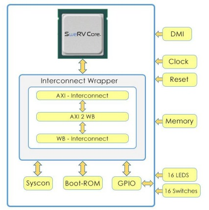

# <p align= "center">Proyecto arquitectura de computadores I.</p>


## Laboratorio 1: Introduction to RVfpga-SoC
Hecho por Karen Fonseca, David Torres y Silvia Rincón.

RVfpga-SoC How to go from a RISC-V Core to a RISC-V SoC? Es un curso gratuito brindado por _Imagination University Programme_ que muestra cómo utilizar RVfpgaNexys y RVfpgaSim, del set de instrucciones RISC-V con el objetivo de ejecutar programas y ampliar el sistema añadiendo periféricos (RVfpga Labs 1-10). Permite afianzar conceptos dentro de la arquitectura del procesador, ubicando los modulos de Instructions fletch, Instruction decode, E. Memory y  Write back. Este curso permite explorar el núcleo y el sistema de memoria mediante la ejecución de simulaciones, la medición del rendimiento, la adición de instrucciones y la modificación del sistema de memoria utiliando herramientas de RISC-V (compiladores y compiladores y depuradores) y simuladores, el simulador HDL Verilator, y el simulador del conjunto de instrucciones Whisper (Whisper) de Western Digital.

Imagen de referencia de las conexiones en la guía de instrucciones de laboratorio:
<p align= "center"> </p>

## Laboratorio 1: Introduction to RVfpga-SoC
En la primeraparte del RVfpga-SoC se muestra cómo construir un subconjunto de SweRVolfX SoC desde cero utilizando bloques de construcción como el núcleo SweRV, las memorias y los periféricos. Para acceder al curso, es necesario crear una cuenta. Una vez logeados a nuestro correo personla será enviado un link de descarga para acceder a los contenidos del curso. 
*Procedimiento del laboratorio*
El Primer laboratorio está constituido por:

Se conectan los IFU (Instruction Fetch Unit), LSU (Load Store Unit) y SB (Store Byte) para empezar a crear las conexiones jerárquicas:

<p align= "center"></p>

Luego se hacen las conexiones externas de RAM(DDR), CLK(Clock), RST(Reset), y DMI(Debug Module Interface):

<p align= "center"></p>

Las conexiones de RST y CLK:

<p align= "center"></p>

RAM en pines exteriores:

<p align= "center"></p>
<p align= "center"></p>

Se agregan y configuran los códigos:

<p align= "center"></p>
<p align= "center"></p>

Se copila y genera el Bitstream:

<p align= "center"></p>
<p align= "center"></p>


## Laboratorio 2: Running Software on RVfpga-SoC

Para esta práctica de Laboratorio, partimos de los resultados en la primera práctica. En este laboratorio se muestra la ejecución del modulo "BD.v" del Lab1 utilizando lenguaje C o lenguaje de ensamblador en el subconjunto SweRVolfX que creamos en el laboratorio 1 mediante el uso de la herramienta de diseño Vivado Block. 
La ejecución se realiza mediante Verilator debido a que no se contaba, de forma física, con la placa Nexys A7. 

Para realizar este laboratorio, usaremos el archivo Verilog "BD.v" del Diseño de Bloques y el archivo de bits "rvfpga.bit" que fue generado en el Laboratorio 1 usando el Diseño de Bloque de Vivado. Para ello partimos de la ruta:

<p align= "center"></p>

En este laboratorio, se generan los binarios de simulación para RVfpgaSim, que se utilizarán posteriormente para crear la traza de simulación de un programa de ejemplo. También analizaremos la traza de simulación utilizando GTKWave.

Como un paso opcional, mostraremos cómo descargar el RVfpgaNexys, como se define en el flujo de bits que creamos en el Laboratorio 1, en nuestra placa Nexys A7 usando PlatformIO y luego depurar un programa de ejemplo usando PlatformIO. Este paso es opcional pero recomendado.

*Instalación*
Para la ejecución de este laboratorio se requieren las siguientes intalaciones:
● Installation of Visual Studio Code (VScode)
● PlatformIO
● Verilator version 4.106
● GTKWave

*Procedimiento del laboratorio*

Para ello, partimos del archivo de diseño. Durante la primera práctica, se realizaron las conexiones de pines extremos. Estas conexiones externas del módulo "Block Design" se conectan en el módulo superior "rvfpgasim" con otros módulos. Por ejemplo, las conexiones externas _DMI_ en el módulo "Block Design" están conectadas con el módulo _dmi_wrapper_ y las conexiones externas "RAM" del módulo "Block Design" están conectadas con el módulo de memoria.

El diseño estpa compuesto por tres módulo:

<p align= "center"></p>

● Diseño en bloque (BD.v): Este es el módulo del SoC que hemos creado utilizando el Diseño en Bloque de Vivado.
● Ram (axi_mem_wrapper.v): Este es el módulo de memoria.
● dmi_wrapper (dmi_wrapper.v): Esta es la interfaz del módulo de depuración.

A partir de la ubicación del archivo en la carpeta, procedimos a generar el binario de simulación para _RvfpgaSim_. El directorio 
```[RVfpgaSoCPath]/RVfpgaSoC/Labs/LabResources/Lab2/verilatorSIM 
```
contiene el Makefile y el script (swervolf_0.7.vc) para generar el binario del simulador para RVfpgaSim. El script contiene información para que Verilator sepa, entre otras cosas, dónde encontrar las fuentes para el SoC, que en nuestro caso están disponibles en:
```[RVfpgaSoCPath]/RVfpgaSoC/Labs/LabResources/Lab2/src
```
Una vez generado el binario del simulador (Vrvfpgasim), lo utilizarás dentro de PlatformIO para generar la traza de simulación (trace.vcd) del programa AL_Operations.


A continuación, generamos el binario para RVfpgaSim, mediante el uso de la traza generada, realizamos la simulación desde PlatformIO
<p align= "center"></p>

Durante la generación del binario de simulación para RvfpgaSim, se presentó el presente error:
<p align= "center"></p>

Sin embargo, se logró solucionar y se visualiza la salida de GTkwave para el caso binario:
<p align= "center"></p>

# Conclusiones

- Este laboratorio explica el paso a paso de construcción de un Soc, visualizando las conexiones entre CPU, las interconexiones y los periféricos.
- La versión de vivado sí importa, ya que de otra forma no permite las conexiones de buses de datos.
- La generación de la traza permite la visualización en GTkwave, esto ocurre a partir de que en el lenguaje C o de ensamblador, se procesa primero el archivo de origen. El ensamblador / C analiza su archivo fuente, lo verifica en busca de errores de sintaxis y lo traduce a su forma binaria equivalente.

# Referencias
- https://university.imgtec.com/resources/download/rvfpgasoc-v1-0/
- https://github.com/chipsalliance/Cores-SweRVolf#swervolf
- https://riscv.org/news/2021/09/new-release-of-swervolf-risc-v-soc-project-aims-for-lower-barrier-to-entry-gareth-halfacree-the-register-2/
- https://university.imgtec.com/wp-content/uploads/2021/10/UPDATE-of-RV-I-Website-listing-for-RVfpga-1.pdf
