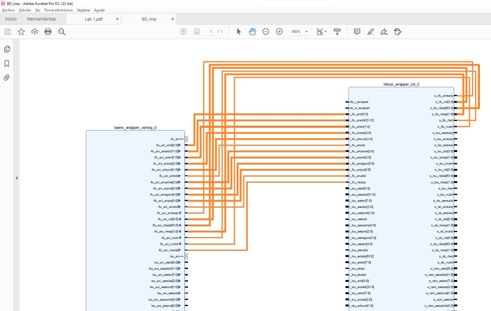
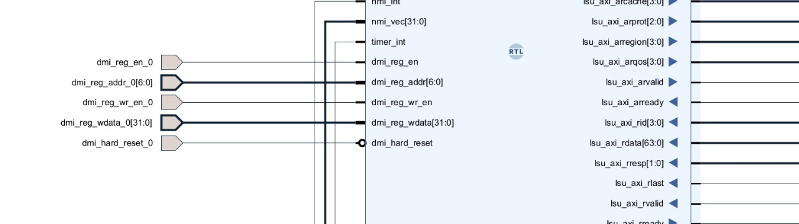
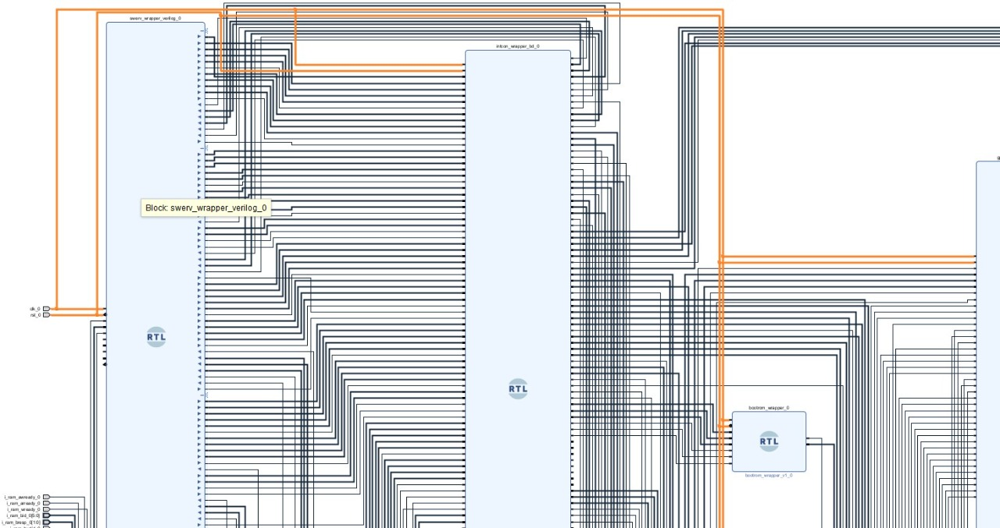
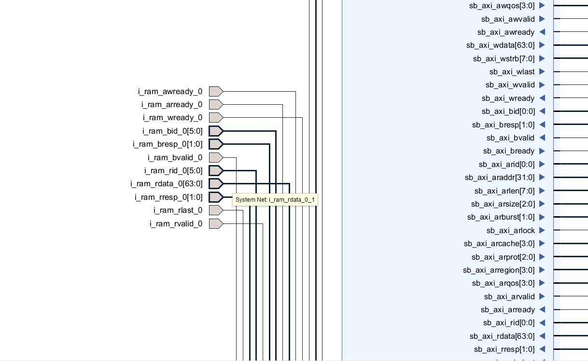
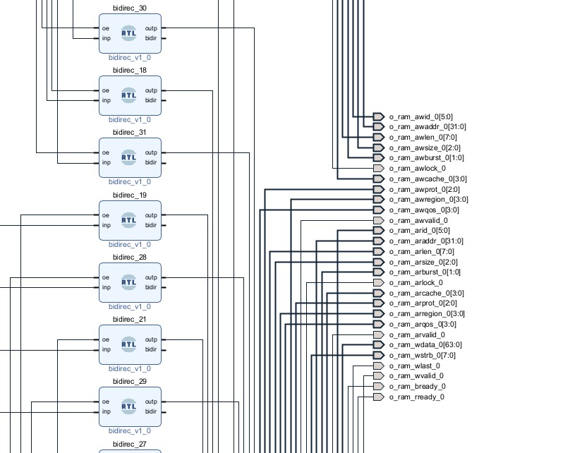
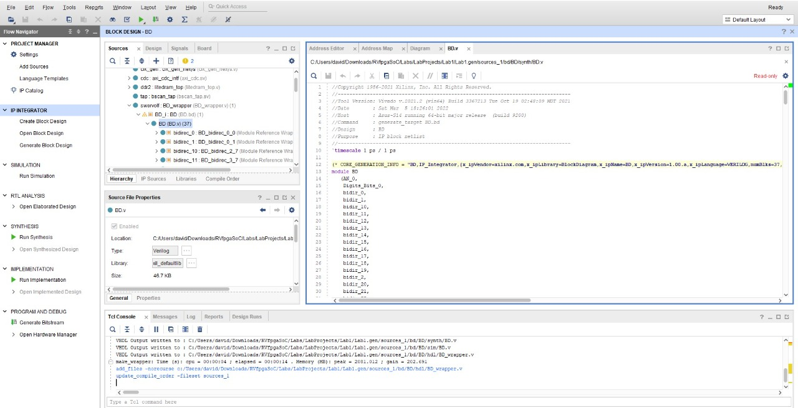
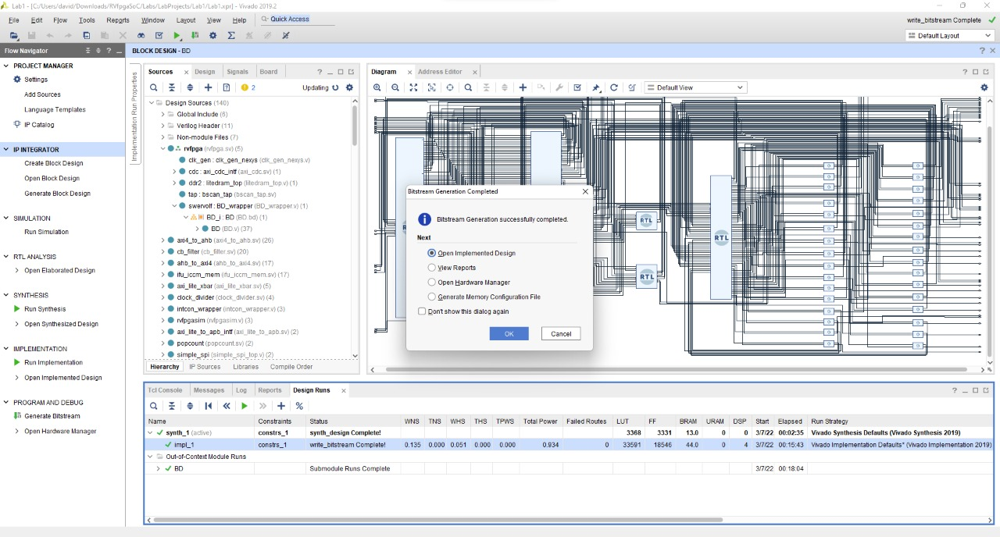
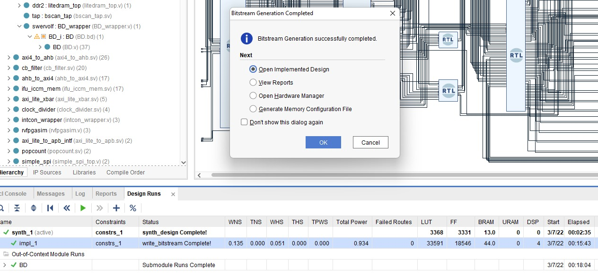

#
Proyecto arquitectura de computadores I.

Hecho por Karen Fonseca, David Torres y Silvia Rincón.

RVfpga-SoC How to go from a RISC-V Core to a RISC-V SoC? Es un curso gratuito brindado por _Imagination University Programme_ que muestra cómo utilizar RVfpgaNexys y RVfpgaSim, del set de instrucciones RISC-V con el objetivo de ejecutar programas y ampliar el sistema añadiendo periféricos (RVfpga Labs 1-10). Permite afianzar conceptos dentro de la arquitectura del procesador, ubicando los modulos de Instructions fletch, Instruction decode, E. Memory y  Write back. Este curso permite explorar el núcleo y el sistema de memoria mediante la ejecución de simulaciones, la medición del rendimiento, la adición de instrucciones y la modificación del sistema de memoria utiliando herramientas de RISC-V (compiladores y compiladores y depuradores) y simuladores, el simulador HDL Verilator, y el simulador del conjunto de instrucciones Whisper (Whisper) de Western Digital.

## Laboratorio 1: Introduction to RVfpga-SoC
En la primeraparte del RVfpga-SoC se muestra cómo construir un subconjunto de SweRVolfX SoC desde cero utilizando bloques de construcción como el núcleo SweRV, las memorias y los periféricos. Para acceder al curso, es necesario crear una cuenta. Una vez logeados a nuestro correo personla será enviado un link de descarga para acceder a los contenidos del curso. 
*Procedimiento del laboratorio*
El Primer laboratorio está constituido por:

Se conectan los IFU (Instruction Fetch Unit), LSU (Load Store Unit) y SB (Store Byte) para empezar a crear las conexiones jerárquicas:

Luego se hacen las conexiones externas de RAM(DDR), CLK(Clock), RST(Reset), y DMI(Debug Module Interface):

Las conexiones de RST y CLK:

RAM en pines exteriores:

Se agregan y configuran los códigos:

Se copila y genera el Bitstream:

## Laboratorio 2: Running Software on RVfpga-SoC
Para esta práctica de Laboratorio, partimos de los resultados en la primera práctica. En este laboratorio se muestra la ejecución del modulo "BD.v" del Lab1 utilizando lenguaje C o lenguaje de ensamblador en el subconjunto SweRVolfX que creamos en el laboratorio 1 mediante el uso de la herramienta de diseño Vivado Block. 
La ejecución se realiza mediante Verilator debido a que no se contaba, de forma física, con la placa Nexys A7. 
Para realizar este laboratorio, usaremos el archivo Verilog "BD.v" del Diseño de Bloques y el archivo de bits "rvfpga.bit" que fue generado en el Laboratorio 1 usando el Diseño de Bloque de Vivado. 
En este laboratorio, se generan los binarios de simulación para RVfpgaSim, que se utilizarán posteriormente para crear la traza de simulación de un programa de ejemplo. También analizaremos la traza de simulación utilizando GTKWave.
Como un paso opcional, mostraremos cómo descargar el RVfpgaNexys, como se define en el flujo de bits que creamos en el Laboratorio 1, en nuestra placa Nexys A7 usando PlatformIO y luego depurar un programa de ejemplo usando PlatformIO. Este paso es opcional pero recomendado.

*Instalación*
Para la ejecución de este laboratorio se requieren las siguientes intalaciones:
● Installation of Visual Studio Code (VScode)
● PlatformIO
● Verilator version 4.106
● GTKWave

*Procedimiento del laboratorio*

# Conclusiones
- La versión de vivado sí importa

# Referencias
- https://university.imgtec.com/resources/download/rvfpgasoc-v1-0/
