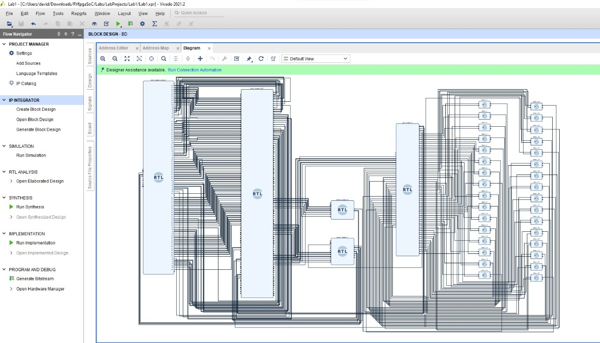

# Proyecto arquitectura de computadores I.

**Laboratorio 1**

*Procedimiento del laboratorio*

**Laboratorio 2**
Para esta práctica de Laboratorio, partimos de los resultados en la primera práctica. En este laboratorio se muestra la ejecución del modulo "BD.v" del Lab1 utilizando lenguaje C o lenguaje de ensamblador en el subconjunto SweRVolfX que creamos en el laboratorio 1 utilizando la herramienta de diseño Vivado Block. 
La ejecución se realiza utilizando la herramienta  Verilator debido a que no se contaba, de forma física, con la placa Nexys A7. 
Para realizar este laboratorio, usarás el archivo Verilog "BD.v" del Diseño de Bloque y el archivo de bits "rvfpga.bit" que fue generado en el Laboratorio 1 usando el Diseño de Bloque de Vivado. 
En este laboratorio, se generan los binarios de simulación para RVfpgaSim, que se utilizarán posteriormente para crear la traza de simulación de un programa de ejemplo. También analizaremos la traza de simulación utilizando GTKWave.
Como un paso opcional, mostraremos cómo descargar el RVfpgaNexys, como se define en el flujo de bits que creamos en el Laboratorio 1, en nuestra placa Nexys A7 usando PlatformIO y luego depurar un programa de ejemplo usando PlatformIO. Este paso es opcional pero recomendado.

*Instalación*

*Procedimiento del laboratorio*

# Conclusiones
- La versión de vivado sí importa

# Referencias
- https://university.imgtec.com/resources/download/rvfpgasoc-v1-0/
